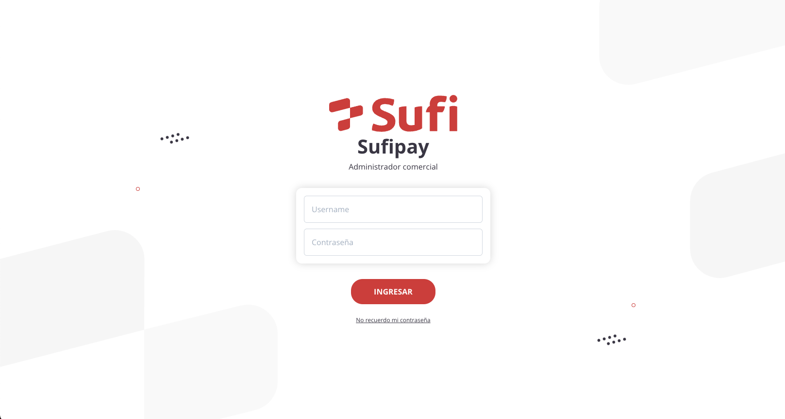

# Test Sufi Red5G

Sufi es un proyecto para desarrollar una aplicación web para la gestión de prestamos bancarios en tiempo real. A continuación se explican las tecnologías utilizadas y las razones por las que se eligieron.

## Tecnologías

- NextJS: fue elegido por su capacidad para pre-renderizar páginas, lo que mejora la velocidad de carga y la experiencia del usuario. También cuenta con un enrutador integrado y optimización de código, lo que lo hace adecuado para proyectos grandes y complejos.
- Tailwindcss: se utilizó para la maquetación y diseño de estilos del proyecto. Su gran variedad de clases reutilizables facilitó la creación de diseños responsivos y personalizados.
- Moment: se utilizó para el manejo de fechas y horarios en la aplicación.
- React CSV: se utilizó para la exportación de archivos CSV en la aplicación. Esta herramienta permitió la generación de archivos CSV de forma rápida y eficiente.
- Swr: se utilizó para la gestión del estado de la aplicación, lo que permitió una mayor eficiencia en la carga de datos y una mejor gestión de la memoria.

## Documentación de las tecnologías usadas

- [NextJS](https://nextjs.org/docs)
- [Tailwindcss](https://tailwindcss.com/docs)
- [Moment](https://momentjs.com/)
- [React CSV](https://github.com/react-csv/react-csv)
- [Swr](https://swr.vercel.app/docs/getting-started)

## Funcionamiento del proyecto

Se realizo una api en NextJs para la gestión de prestamos bancarios en tiempo real. La aplicación cuenta con un login para el ingreso de usuarios, una tabla para la visualización de los prestamos y un botón para la exportación de los datos en formato CSV.

## Instalación del proyecto

- Se requiere tener instalado [Node.js](https://nodejs.org/) v10+.
- Clonar el repositorio con el comando git clone + la ruta del proyecto
- Guía para la instalación de las dependencias para correr el proyecto.

```sh
cd sufi-red5g
yarn
yarn dev
```

## Previsualización del proyecto



